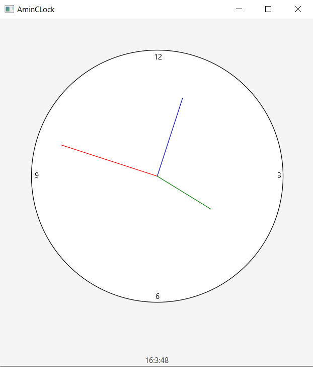

# Analog-Clock-from-Scratch-JFX
an analog clock made from scratch using Java Fx library 
# up coming features 

-[x]**making the clock dynamic** so its changes with every seconds not just static time 
- adding 3 buttons that their main functions are : 
- **reset button** : which reset hours , minuts ,seconds to zero which may make it look like a stoipwatch 
- **set local time button** : put the local time 
- **set custom time** : set the time to the user custom time 
- **a video or a small readme file explaining the algorithms that i implented  soon**
- i may make it an exe dekstop who knows
- the main reason i created is to **apply OOP principles and get comfortable using javafx** 

##here is what does it look like 

"it ain't that much , but its an honest work" 
